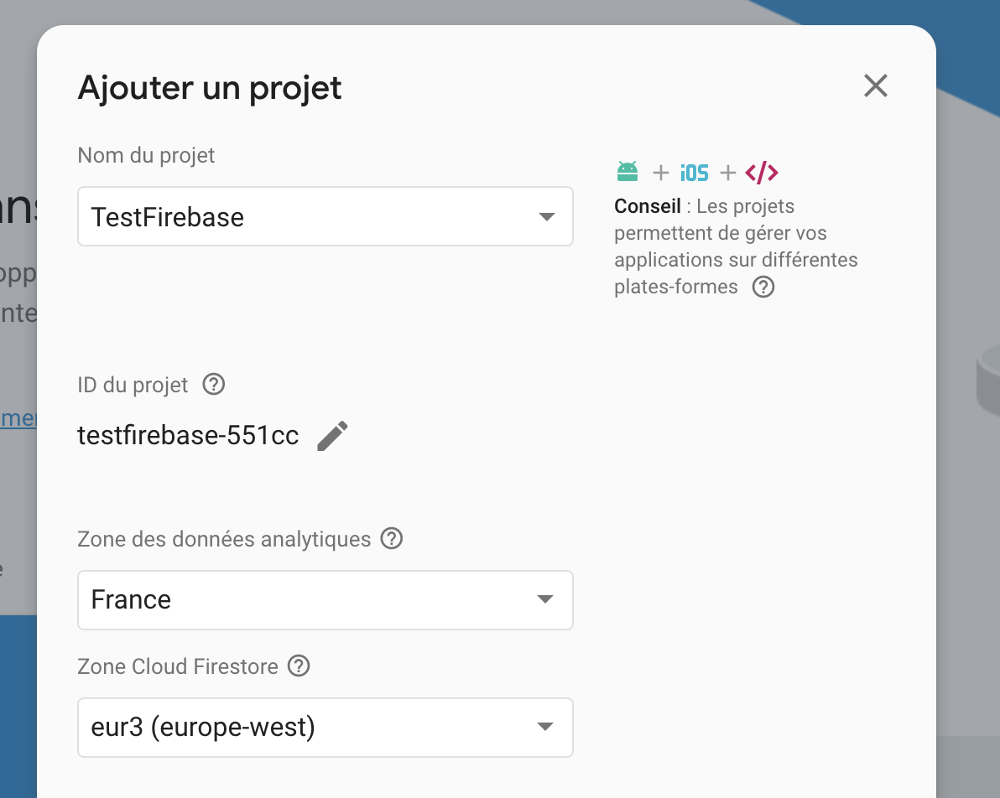
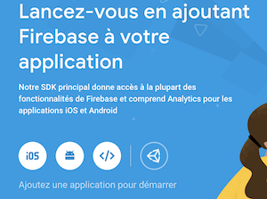
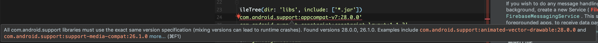
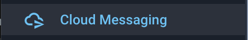
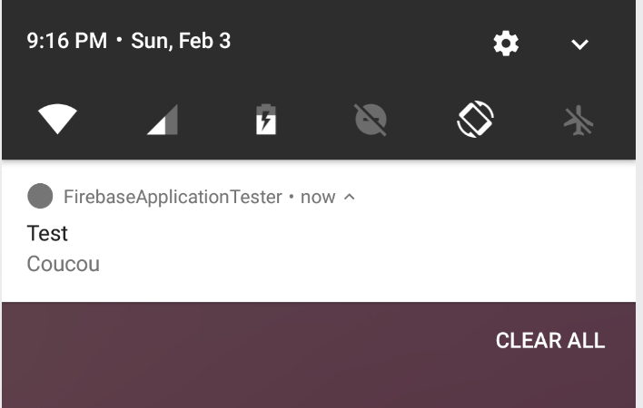
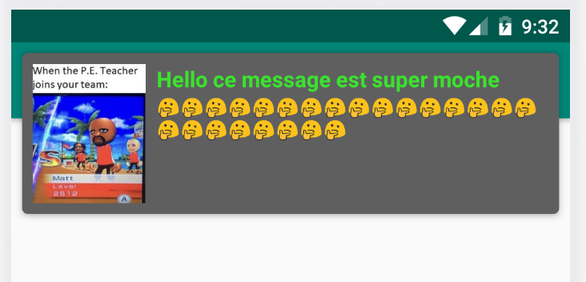

# TP Firebase
Dans ce TP vous allez apprendre à vous servir de Firebase, une suite d'outils qui vous permettront de coder rapidement une application mobile performante sans vous soucier du Back-end.

## Notions
- Créer un projet Firebase
- Utiliser l'assistant Android Studio pour Firebase
- Parcourir une documentation et s'en servir dans votre projet
- Construire une notification dans votre application
- Utiliser les notifications via FCM (GCM est déprécié) 

## Setup
### Etape 1 - Mise en place de Firebase
- Connectez vous sur Firebase à l'adresse suivante : https://console.firebase.google.com avec votre compte Google.
- Une fois connecté créez un projet avec le nom de votre choix. 
    > Un projet sur Firebase contient des "applications" qui peuvent être sur iOS, Android, le Web, C++ etc. Donc 1 projet = 1+ application(s)
    
- Créez une application dans le projet avec comme système `Android`
    
- Suivez l'assistant de création d'application, si vous avez un doute sur un champ ouvrez les bulles d'aide sur l'interface.
- Voilà vous avez créé un backend à votre application. Ce back-end géré par Firebase va vous permettre de faire enormément de choses sans beaucoup coder.

### Etape 2 - Connecter Firebase à Android Studio
- Android Studio et Firebase communiquent naturellement (les 2 sont des produits fait par Google)
- Cliquez sur `Tools > Firebase` dans Android Studio, un assistant va démarrer sur le coté pour vous guider dans l'implémentation des divers outils Firebase. Y'a pas plus simple.
- Puis selectionnez `Cloud Messaging` 
    > Si l'assistant vous demande de vous connecter avec votre compte Google, connectez vous et avec le compte sur lequel vous êtes connecté à Firebase evidemment.
- **🚧 Attention partie très technique (non pas du tout)! 🚧** 
  - Suivez l'assistant correctement. 👶
  - > L'assistant est là pour faire tout le boulot à votre place, mais n'est pas parfait, il peut se tromper dans les dépendances `Gradle` qu'il ajoute au projet, donc soyez attentif et corriger les versions / nom si besoin
  - Vous allez tomber sur cette erreur peut-être, dans ce cas ajouter les dépendances explicitement avec les bonnes versions jusqu'à ce que l'erreur disparaisse 

- L'assistant va vous demander de créer un `service`, un service est comme une `activity` mais qui tourne en fond, il n'a pas d'interface, cela permet à une application d'executer des actions en tache ce fond sur votre téléphone. 
  - [Pour une explication plus précise du concept cliquez sur ce lien](https://google-developer-training.github.io/android-developer-fundamentals-course-concepts-v2/unit-3-working-in-the-background/lesson-7-background-tasks/7-4-c-services/7-4-c-services.html)
- Evidemment supprimez toutes fonctions superflues du code que l'assistant va vous proposer. Lisez bien les commentaires.
### Etape 3 - Fonctionnement des notifications a distance
- Sur mobile, le système de notification est normé. Un serveur va envoyer à votre téléphone et uniquement au votre une notification.
  - Pour cela il faut absolument un identifiant qui permet au système d'exploitation du téléphone et au serveur de communiquer de manière unique et fiable. Vous n'aimeriez pas qu'une notification qui vous est destinée arrive sur le téléphone de quelqu'un d'autre, pire de toutes les personnes qui ont la meme app que vous !
  - Cet identifiant s'appelle un `token` (ou jeton), que ce soit sur iOS ou Android c'est le meme principe.
#### Comment ca marche ?
Au démarrage de l'application le téléphone va faire une demande de jeton au serveur, qui va lui envoyer un `token` unique pour cette `application` et ce `téléphone`.    
Le `token` est amené à évoluer dans le temps pour éviter de pouvoir identifier de manière unique ce téléphone à des fins de publicité ou de hack par exemple.   

#### Récuperer votre token
- Le code que l'assistant Firebase vous a fourni pour votre `service` permet de l'afficher dans le `logcat`, donc vous devriez retrouver une ligne qui ressemble à ca :    
  - `2019-02-01 21:08:55.922 27919-27955/? D/FCM_Service: Refreshed Token: fEAn6323-XM:APA91bEKAWPaskfEmaeoYDMhNwqm1q5VnioyOlBcR7fgz_IAHhlLfBjtjT1s2rNyz_4zhWXGDOrV8RM3DrFALtYh-vk50mMtQqAtw4Aasn886gUVpMVi3MvcSvf9cxazx3gjrJIbVEua`

- Voici aussi un morceau de code pour l'afficher dans votre activité principale sur l'interface pour mieux constater ce qu'il se passe 

```java
//C'est une fonction asynchrone, donc on attend le resultat dans un listener anonyme
FirebaseInstanceId.getInstance().getInstanceId()
    .addOnCompleteListener(new OnCompleteListener<InstanceIdResult>() {
        @Override
        public void onComplete(@NonNull Task<InstanceIdResult> task) {
            if (!task.isSuccessful()) {
                Log.w(TAG, "getInstanceId failed", task.getException());
                return;
            }

            // Permet de récuperer le token reçu par le serveur
            String token = task.getResult().getToken();
            //Main TextView c'est un textview sur votre activité tout simplement pour l'afficher
            mMainTextView.setText(token);
    
            Log.d(TAG, token);
        }
    });
```

### Etape 4 - Envoyer une notification !
- Retournez sur votre console firebase dans l'application qui correspond à ce TP, et trouver l'icone `Cloud Messaging` 
  - 
- Créez une nouvelle notification ici, vous pouvez suivre la totalité du formulaire, ou cliquer sur le bouton `test on device` qui permet d'entrer le `token` que l'on a affiché en **étape 3** puis de tester.

- Normalement vous devriez voir apparaitre votre notification sur le téléphone si l'app n'est pas au premier plan.


- Par défaut la notification ouvre votre application. Mais vous pouvez TOUT personnaliser.

**Voilà ! Super facile non ? C'est que de la configuration, pas beaucoup de code**    

*Point UX*    
Les notifications sont un excellent moyen de fidéliser vos utilisateurs, et d'apporter un accès rapide à l'application, en plus de la rendre bien plus vivante !

## Exercices

### Exercice 1 
- Ajoutez à votre application l'outils Firebase suivant : `In-AppMessaging`
- Trouvez l'endroit dans votre console où vous pouvez configurer tout cela. Trouvez la documentation pour ensuite injecter le tout dans votre app et enfin testez !
- Exemple d'accomplissement du module `In-AppMessage` 
  - 
- Appelez l'enseignant pour faire valider.
### Exercice 2
- Maintenant on va voir comment construire à la main des notifications local et comment les personnaliser.
- [Suivez le codelabs 8.1](https://codelabs.developers.google.com/codelabs/android-training-notifications)
- Appelez l'enseignant pour faire valider