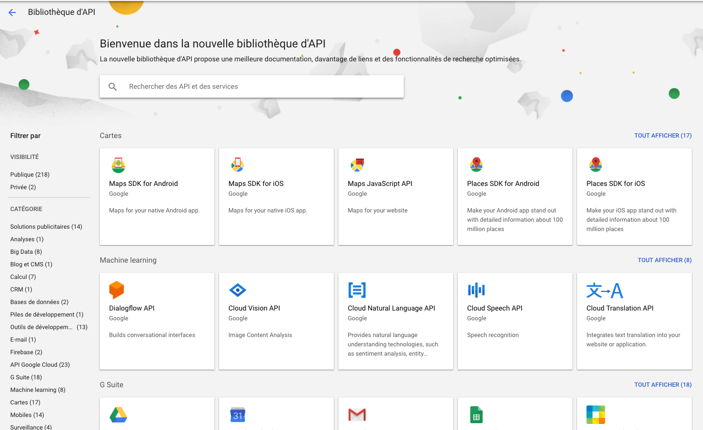
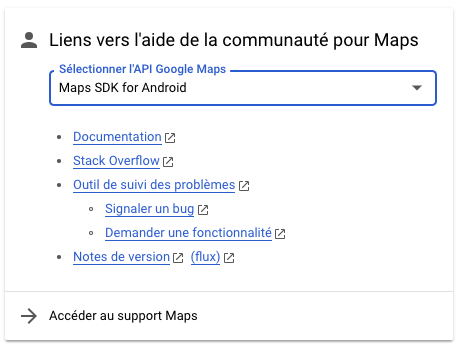
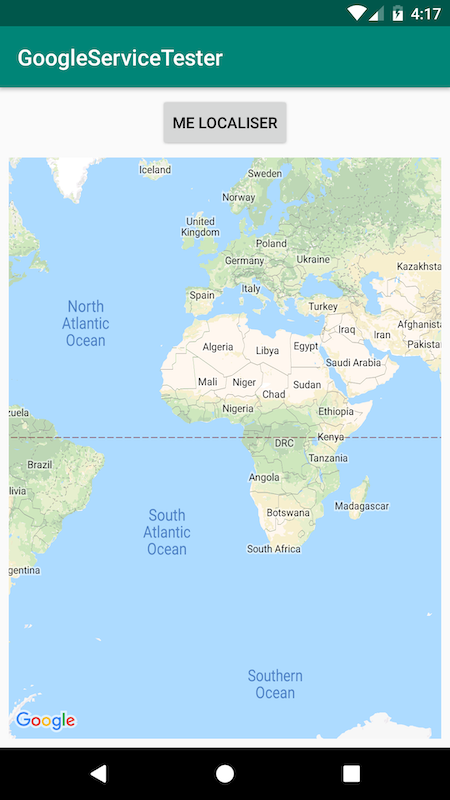
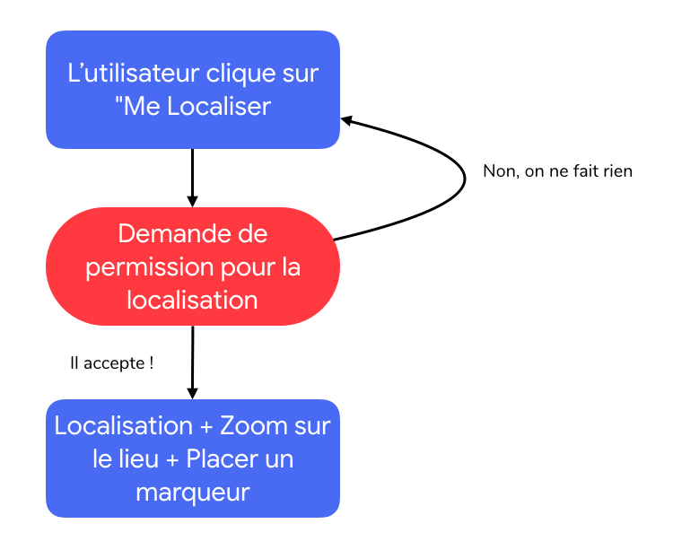
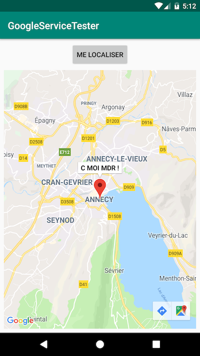

# TP Google services
Dans ce TP vous allez apprendre à utiliser plusieurs services google, les plus utiles pour composer une application mobile. 

## Notions
- Récuperer une clé d'API pour un service Google
- Implémenter une Carte Google Maps dans votre application 
- Detecter la localisation GPS du téléphone et l'afficher
- Parcourir une documentation et s'en servir dans votre projet

## Setup 
### Etape 1 - Créer le projet
Créer un nouveau projet Android Studio avec une Activité Vide. 

Dans le manifest du projet ajouter les permissions d'accès à la localisation précise `FINE_LOCATION`
```xml
 <uses-permission android:name="android.permission.ACCESS_FINE_LOCATION" />
```

#### Ajouter les services Google play `googlePlayServices`
> **Pré-requis**   
> Il faut que votre émulateur ou votre téléphone de test aient les Google Play Services à jour pour pouvoir continuer le TP
> Vous avez 2 choix pour l'émulateur : 
>   - Télécharger un nouvel émulateur avec la version `7.1.1` d'Android 
>   - Connecter votre compte Google sur l'émulateur, aller sur le **Play Store** et mettre à jour les Google Play Services
>   - Si votre émulateur n'a pas le Google Play Store, vous devez télécharger une version d'Android avec le logo Google Play : 


- Dans votre fichier `build.gradle` ajouter les dépendances nécessaire pour accéder aux services Google Play : 
Il faut s'assurer que vous trouviez bien la ligne suivant dans `repositories`
    `google()` **ou** `maven { url "https://maven.google.com" }`
 
- Ensuite il faut importer les bibliothèques qui vont nous être utiles. Puisque nous allons avoir besoin de la localisation, il faut que vous ajoutiez la **bonne bibliothèque** depuis cette liste :

    | Google+                                  | com.google.android.gms:play-services-plus:16.0.0      |
    |------------------------------------------|-------------------------------------------------------|
    | Google Account Login                     | com.google.android.gms:play-services-auth:16.0.1      |
    | Google Actions, Base Client Library      | com.google.android.gms:play-services-base:16.1.0      |
    | Google Sign In                           | com.google.android.gms:play-services-identity:16.0.0  |
    | Google Analytics                         | com.google.android.gms:play-services-analytics:16.0.6 |
    | Google Awareness                         | com.google.android.gms:play-services-awareness:16.0.0 |
    | Google Cast                              | com.google.android.gms:play-services-cast:16.1.2      |
    | Google Cloud Messaging                   | com.google.android.gms:play-services-gcm:16.0.0       |
    | Google Drive                             | com.google.android.gms:play-services-drive:16.0.0     |
    | Google Fit                               | com.google.android.gms:play-services-fitness:16.0.1   |
    | Google Location and Activity Recognition | com.google.android.gms:play-services-location:16.0.0  |
    | Google Mobile Ads                        | com.google.android.gms:play-services-ads:17.1.2       |
    | Mobile Vision                            | com.google.android.gms:play-services-vision:17.0.2    |
    | Google Nearby                            | com.google.android.gms:play-services-nearby:16.0.0    |
    | Google Panorama Viewer                   | com.google.android.gms:play-services-panorama:16.0.0  |
    | Google Play Game services                | com.google.android.gms:play-services-games:16.0.0     |
    | SafetyNet                                | com.google.android.gms:play-services-safetynet:16.0.0 |
    | Google Pay                               | com.google.android.gms:play-services-wallet:16.0.1    |
    | Wear OS by Google                        | com.google.android.gms:play-services-wearable:16.0.1  |

- Comme vous pouvez le voir il y a plein de services sympa, à vous de rechercher un peu ce qu'ils peuvent faire, si cela vous donne des idées d'applications pour le future ;)

- Synchroniser `Gradle` et si tout se passe bien, c'est que vous êtes bon pour cette étape, faites valider par l'enseignant.

### Etape 2 - Clé d'API pour Maps
Pour pouvoir utiliser les services Google, il faut que Google vous connaisse, ce n'est pas gratuit. 
L'API Google Maps est disponible au travers du site des Google API's, ce n'est pas via Firebase.

1. Il faut donc vous connecter à l'adresse suivante : 
https://console.developers.google.com 
2. Vous devez alors créer un nouveau projet, nommer le comme vous voulez, il contiendra les accès aux API dont vous aurez besoin, un projet Google Console peut aussi contenir toutes sortes de services Google, comme un hebergement, une base de données etc.
3. Cliquer ensuite sur "Bibliothèque" dans le menu de gauche, vous devriez voir apparaitre un écran de ce genre :   
   
4. Nous allons utiliser le SDK Google Maps pour Android, il faut donc le chercher et cliquer dessus, puis l'activer. Il devrait y avoir un léger temps d'initialisation.
5. Vous avez maintenant accès aux service de Google Maps pour Android. 
6. Créer votre clé d'API qui sera intégrer dans votre applications pour que les serveurs Google vous autorisent à utiliser Google Maps dans votre application comme suit : `Identifiants > Créer des identifiants > Clé d'API`
7. Le service vous présente la clé, copier la quelque part.  

### Etape 3 - Intégrer la clé d'API dans votre application
Pour faire propre il faut d'abord créer un fichier de ressources dans `/res`, appelez le comme vous voudrez et mettez cela à l'interieur   

```xml
<resources>
    <!-- Once you have your key (it starts with "AIza"), replace the "google_maps_key"
    string in this file.-->
    <string name="google_maps_key" templateMergeStrategy="preserve" translatable="false">{youKeyHere}</string>
</resources>
```   

- Il faut aussi que vous mettiez une référence à cette clé dans votre manifest, en intégrant les Services Google à votre application, l'application Google Play Service va fusionner son manifest avec le votre, et à besoin de savoir que vous avez une bonne clé d'API   

```xml
 <meta-data
        android:name="com.google.android.geo.API_KEY"
        android:value="@string/google_maps_key" />
```   

Voilà vous êtes paré à commencer à Coder ! Non en fait faut lire la documentation ;)

## Exercices 
### Exercice 1 - Lire la documentation de Google Maps API
- Il faut que vous implémentiez une vue du monde avec Google Map dans votre application.
- Retournez dans la Console Google où se trouve votre projet et trouver le lien vers la documentation qui doit ressembler à ca : 
- Cliquer sur `Documentation`
- Une fois la documentation affiché, vous trouverez beaucoup d'aide, et en fouillant un peu vous pourrez retrouver tout ce que nous avons fait jusqu'a présent. Il est très important de savoir naviguer dans une documentation, de trouver les bonnes ressources sur le net ou en explorant des exemples de code. 
- Normalement vous pouvez facilement ajouter une carte à votre application Android en allant dans la section `Creating a Map` et `Map Objects`. 
- Compiler et faites en sorte que l'application fonctionne. 
- Arretez vous et faites valider par l'enseignant dès que vous aurez ajouté le `Marker` sur votre carte.

### Exercice 2 - Detecter la position du téléphone
Vous avez votre super carte ? Super, maintenant recréer cette interface : 
   
- Ajouter un listener au bouton `Me Localiser` dans votre Activité

- Ajouter dans `build.gradle` les dépendances suivantes si ce n'est pas déjà le cas : 
    ```groovy
    //Google Maps
    implementation 'com.google.android.gms:play-services-maps:16.0.0' 
    //Google Location Provider, pour acceder à la localisation du téléphone
    implementation 'com.google.android.gms:play-services-location:16.0.0'
    ```
- Affichez un `Toast`lors du clique sur le bouton "Me Localiser" et **faites valider par l'enseignant**

- Pour localiser le téléphone vous allez avoir besoin de plusieurs objets :     
    ```java
        //Une variable définissant le Zoom de votre carte
        private static final float DEFAULT_ZOOM = 12; 
        // Fait en exercice 2
        private GoogleMap mMap; 
        //Identifiant de la demande de permission
        private static final int PERMISSIONS_REQUEST_ACCESS_FINE_LOCATION = 1; 
        //Si l'utilisateur à autoriser la localisation ou non
        private Boolean mLocationPermissionGranted = false; 
        //Dernière position détéctée
        private Location mLastKnowLocation; 
        //Permet de récuperer la position
        private FusedLocationProviderClient mFusedLocationProviderClient; 
        //Une position par défault au cas où
        private LatLng mDefaultLocation;
    ```   
- Créer ces variables d'instance dans `MainActivity` et initialisez les dans `onCreate`

#### Les Permissions
A partir de la version 6 d'Android les développeurs d'application doivent demander explicitement à l'utilisateur l'autorisation d'avoir accès à certaines fonctionnalités du téléphone. La localisation en fait partie.    

Avant de detecter la position du téléphone il va falloir demander à l'utilisateur si il le veut bien.   
[Plus de détails ici avec une vidéo](https://www.youtube.com/watch?v=C8lUdPVSzDk)

> Les permissions sont fastidieuses à gérer mais très importantes dans l'experience utilisateur, trop de permissions demandées et il désinstalle. Demandez les au moment où l'utilisateur souhaite accéder à une fonction particulière qui nécessite une permission. **Ne demandez pas tout d'un coup au démarrage de l'app.**   

    

- Voici le code pour demander la permission de localisation :      
    
    ```java
    //On implémente l'interface pour recevoir la réponse de l'utilisateur lors de la demande de permission
    public class MainActivity implements ActivityCompat.OnRequestPermissionsResultCallback
    
    [...]
    
    //On reçoit la réponse de l'utilisateur ici 
    @Override 
    public void onRequestPermissionsResult(int requestCode, @NonNull String[] permissions, @NonNull int[] grantResults) {
            mLocationPermissionGranted = false;
            switch (requestCode) {
                case PERMISSIONS_REQUEST_ACCESS_FINE_LOCATION: {
                    // If request is cancelled, the result arrays are empty.
                    if (grantResults.length > 0
                            && grantResults[0] == PackageManager.PERMISSION_GRANTED) {
                        mLocationPermissionGranted = true;
                    }
                }
            }
    }

    //On demande la permission ici
    protected void getLocationPermission(){
        if (ContextCompat.checkSelfPermission(this.getApplicationContext(),
                android.Manifest.permission.ACCESS_FINE_LOCATION)
                == PackageManager.PERMISSION_GRANTED) {
            mLocationPermissionGranted = true;
        } else {
            ActivityCompat.requestPermissions(this,
                    new String[]{android.Manifest.permission.ACCESS_FINE_LOCATION},
                    PERMISSIONS_REQUEST_ACCESS_FINE_LOCATION);
        }
    }
    ```    
#### Detecter la position et centrer la caméra sur le lieu

> Vous allez devoir utiliser l'API Google Maps couplé au Service Google Play de Localisation pour réaliser cela.

- Quand l'utilisateur clique sur le bouton de localisation, vous devrez vérifier les permissions, detecter la position et enfin bouger la caméra où il faut.
- Pour récuperer la position du téléphone     

```java
private void getDeviceLocation() {
        try {
            //On Check toujours si on a le droit, sinon ca plante.
            if(mLocationPermissionGranted){
                //On demande à notre service de localisation de trouver la position actuelle
                @SuppressLint("MissingPermission") Task locationResult = mFusedLocationProviderClient.getLastLocation(); 
                //Puisque c'est de l'asynchrone. On ajoute un écouteur qui nous préviens quand la detection est finie.
                //On ne sait jamais si le GPS marche, si il est lent #wiko, le temps de match des satellites.
                // De plus la position peut-etre déduite par pléthore de systèmes : Wifi, Bluetooth, Antenne LTE, etc.)
                locationResult.addOnCompleteListener(this, new OnCompleteListener() {
                    @Override
                    public void onComplete(@NonNull Task task) {
                        //Une fois la detection effectuée, on vérifie que tout est OK
                        if(task.isSuccessful()){
                            //Si oui on attribue la dernière localisation à notre variable pour la garder dans un coin.
                            mLastKnowLocation = (Location) task.getResult();
                            
                            //Et la on bouge la camérae sur le point Latitude / Longitude qui correspond à notre position.
                            mMap.moveCamera(CameraUpdateFactory.newLatLngZoom(
                                    //LatLng est un objet représentant une position sur Terre
                                    new LatLng(
                                            mLastKnowLocation.getLatitude(),
                                            mLastKnowLocation.getLongitude()
                                    ), DEFAULT_ZOOM //Votre Zoom par défaut
                            )
                            );
                        }else {
                            //Traitement du cas où on ne trouve pas de position.
                            Log.d(TAG, "Current location is null. Using defaults.");
                            Log.e(TAG, "Exception: %s", task.getException());
                            mMap.moveCamera(CameraUpdateFactory.newLatLngZoom(mDefaultLocation, DEFAULT_ZOOM));
                            mMap.getUiSettings().setMyLocationButtonEnabled(false);
                        }
                    }
                });
            }
        } catch (SecurityException e){
            Log.e(TAG, e.getMessage());
        }
    }
```
- Faite valider par l'enseignant
- Bonus ajouter un `Marker` de position la où vous vous trouvez sur la carte    

