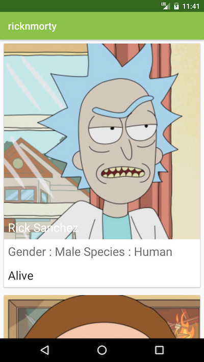
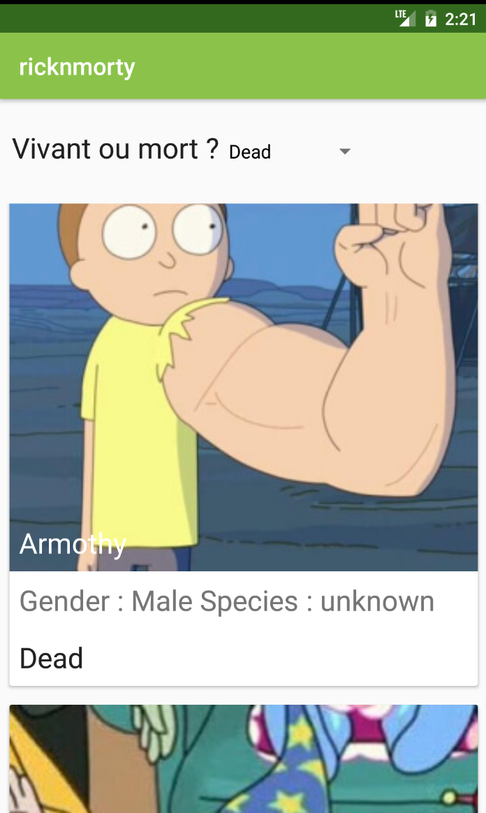

# TP Rick and Morty
Vous allez devoir créer une app en étant un peu plus libre qu'avec les codelabs de Google.

   

**C'est un exercice individuel**   
## Notions
**Ce que vous devez déjà maitriser**   
- Récuperer les dernières informations des personnages depuis une API situé sur un serveur à distance
- Transformer les données brutes reçues par le serveur en objets utilisable dans votre application
- Utiliser les objets pour "remplir" l'interface.
- Vous devez avoir terminés les [codelabs](https://developer.android.com/courses/fundamentals-training/toc-v2) suivants pour être au top :
  - 2.1 + 2.2
  - 4.5
  - 5.2
  - 7.2

> [Lien vers les Android Codelabs](https://developer.android.com/courses/fundamentals-training/toc-v2)

**Notion de programmation Android / Mobile**   
Le but de ce document est de vous montrer les concepts principaux que vous aller devoir implémenter par vous meme pour que l'application tourne.

**Notion de concepteur de logiciel**   
Il va aussi vous apprendre ce que vous devrez faire avant de vous lancer dans la programmation d'une application mobile.

**Notions du créateur de logiciel**   
Le document introduit également les bonnes pratiques de (levez vous et dites radiateur) programmation, quand vous créez, explorer et recherchez des ressources sur internet, les questions que vous devrez vous posez pour être  efficace.

## Briefing de l'application, son but.
Vous voulez vous faire un nom dans le développement d'app mobile.
Votre cible type est un utilisateur d'Android depuis longtemps, fan de Rick & Morty ou n'importe quelle personne qui souhaite connaitre les détails de la série.
Il (l'utilisateur) veut dans un premier temps connaitre les personnages de la série. Pour cela il souhaite les parcourir, afin d'en avoir un aperçu rapide, puis si il le souhaite, il pourra en savoir plus sur un personnage en particulier.

[Vous avez de la chance, quelqu'un sur internet à créer une API qui rescence toutes les informations interessante sur la série ici](https://rickandmortyapi.com/)

----- 
### Exercice 0 - Lire le sujet 

> 7 minutes max   

###  Exercice 1 - Conception d'une application

> 10 minutes max   

- Lisez le brief qui explique l'utilité final de l'application au dessus.
- Explorer un peu la documentation de l'API :
  - Lister ce que l'API peut faire.
  - Si il y a besoin d'une clé d'API, si oui il faudra savoir comment en avoir une.
  - Si il y a une limite d'utilisation de l'API, si oui indiquer la
  - Qui est l'auteur de l'API et pourquoi il l'a créé.
  - Quelles sont les licences de l'API ? Avez vous le droit de vous faire de l'argent avec ? Devez vous indiquer sur votre app la provenance des données ? etc.
  - Si l'API est encore maintenue, si oui par qui et depuis combien de temps ?
- Créer une liste sur un document quelconque qui liste les fonctionnalités principales de l'application. (Pensez `BREAD`)
- Créer un `flowchart` UML (utilisez [Draw.io](https://draw.io) par exemple) qui décrira le parcours utilisateur simple
- Demander à l'enseignant de valider.

### Exercice 2 - Analyse Technique

> 30 minutes max   

- Reprenez la liste des fonctionnalités que vous avez réalisé en **1** et pour chaque fonctionnalité noter les besoins et contraintes techniques 
  -  **Par exemple** : Quels objets allez vous avoir besoin ? Quels composants Material ? Quelles bibliothèques allez vous devoir utiliser ?
  - Justifier chaque choix par une raison logique lié à l'experience utilisateur ou à des contraintes techniques / d'environnement.
- Créer le diagramme de classe UML qui representera votre ou vos objets. ([Draw.io](https://draw.io))
- Demander à l'enseignant de valider.

### Exercice 3 - Réalisation de l'application

> 1h max   

- Réaliser l'application, vous devriez avoir assez d'informations grâce aux exercices 1 & 2 pour pouvoir avancer rapidement.
- Demander à l'enseignant de valider.

### Exercice 4 - Améliorer l'application

> 45m max   

- Faites en sorte que l'utilisateur filtrer la liste des personnages par status : Vivant / Mort

- Bonus : Ajouter un bouton `Retour` à votre AppBar, changer l'icone et le thème de l'application pour une meilleure immersion de l'utilisateur. 
- Demander à l'enseignant de valider.

### Exercice 5 (Bonus) - Les mondes
> ?m max
- Implémenter un navigateur de localisations depuis les routes `location` de l'API Rick N Morty

## Les notions techniques que vous devez maitriser
- `Layout` -> Notion de base mais il faut savoir fair un layout qui soit adapté à différentes tailles d'écran.
- `Material Design Card` -> Implémenter un élément material 
- `Recycler View` -> Implémenter une recycler view dans une activité
- `Activity + Intent` -> En cliquant sur une image de personnage l'activité contenant la liste des personnages doit ouvrir une autre activité qui contient les détails du personnage cliqué dans la liste.
- `HTTP & GET Request` -> Récuperer la liste des personnage en faisant un appel réseau à une API
- `AsyncTask + AsyncTaskLoader` -> Faire un appel réseau fluide en déportant le traitement de la requete sur un `thread` asynchrone
- `JSON + JSONObject API` -> Pouvoir parser les données reçu avec l'ensemble des fonctions de `JSONObject`
- `Model de MVC` -> Vous maitriser le `MVC` il faudra implémenter la partie `Model` avec une ou plusieurs classe qui vous permettront de gérer les données reçus de l'API pour votre interface.

## Tips 
- Pour charger une image dans une imageView utilisez [Glide](https://github.com/bumptech/glide)
- Essayer d'utiliser ce que vous avez vu dans les codelabs. Vous gagnerez du temps.
- Pour faire un équivalent à `<select>`sur Android : [Spinner](https://developer.android.com/guide/topics/ui/controls/spinner#java) 